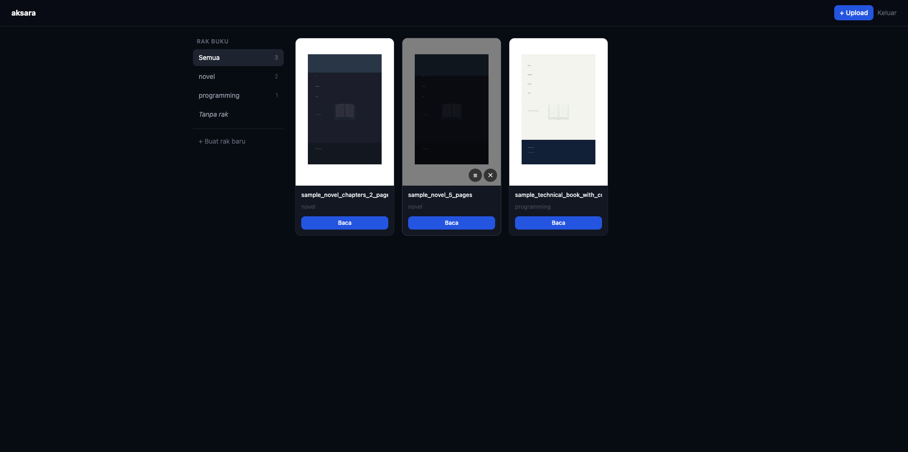
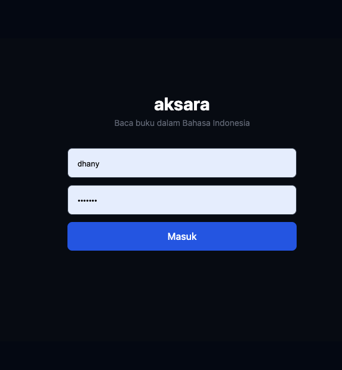
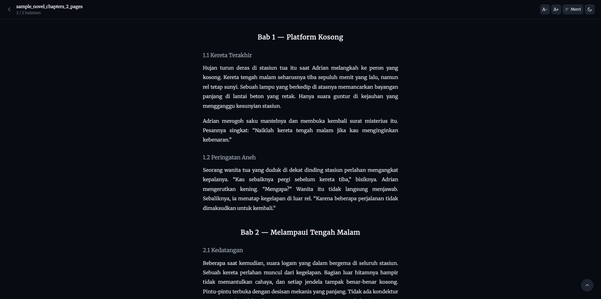
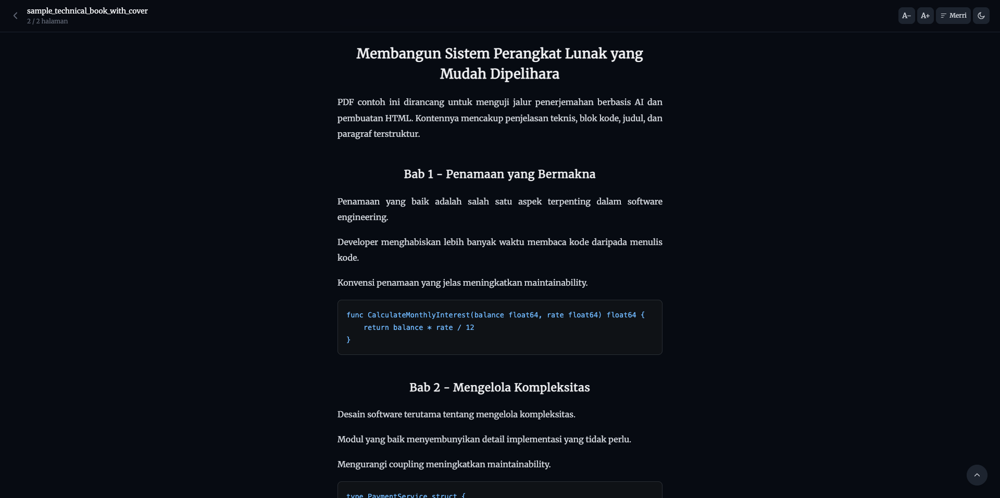

# Aksara

Self-hosted AI-powered e-reader that translates English PDF books into natural Indonesian and serves them as a clean, mobile-friendly reading experience.



## Screenshots

| Login | Library |
|-------|---------|
|  |  |

| Novel | Technical Book |
|-------|----------------|
|  |  |

## Features

- Upload English PDF books
- Automatic translation to Indonesian via DeepSeek API
- Preserves code blocks and software engineering terms
- Clean HTML reader (not a PDF viewer)
- Lazy-load pages for fast reading
- Resumes reading from last scroll position
- Dark / Light mode toggle
- 6 font choices (Sans, Inter, Nunito, Lora, Source Serif, Merriweather)
- Adjustable font size
- Organize books into shelves
- Single-user, self-hosted

## Tech Stack

| Layer | Technology |
|-------|-----------|
| Backend | Go + Echo |
| AI | DeepSeek API |
| PDF Extraction | Python + PyMuPDF |
| Frontend | Server-rendered HTML + Tailwind CSS |
| Database | SQLite |
| Deployment | Docker Compose |

## Setup

### Prerequisites

- Docker + Docker Compose
- DeepSeek API key — [api-docs.deepseek.com](https://api-docs.deepseek.com)

### 1. Clone and configure

```bash
git clone <repo>
cd aksara
cp .env.example .env
```

Edit `.env`:

```env
DEEPSEEK_API_KEY=sk-xxx
DEEPSEEK_MODEL=deepseek-chat
SESSION_SECRET=change-this-to-a-random-string
ADMIN_USERNAME=admin
ADMIN_PASSWORD_HASH=$$2a$$10$$...   # bcrypt hash — note $$ for Docker Compose
PORT=8080
DATA_DIR=./data
STORAGE_DIR=./storage
```

Generate a bcrypt hash for your password:

```bash
# Option 1: htpasswd (Apache utils)
htpasswd -bnBC 10 "" yourpassword | tr -d ':\n'

# Option 2: Python
python3 -c "import bcrypt; print(bcrypt.hashpw(b'yourpassword', bcrypt.gensalt(rounds=10)).decode())"
```

> **Note:** In `.env`, replace every `$` in the hash with `$$` so Docker Compose does not treat them as variable references.

### 2. Run

```bash
docker compose up -d
```

Open [http://localhost:8080](http://localhost:8080)

### Development (without Docker)

Requirements: Go 1.22+, Python 3.10+

```bash
pip install pymupdf
go run ./cmd/server
```

## Environment Variables

| Variable | Required | Default | Description |
|----------|----------|---------|-------------|
| `DEEPSEEK_API_KEY` | yes | — | DeepSeek API key |
| `DEEPSEEK_MODEL` | no | `deepseek-chat` | Model to use |
| `SESSION_SECRET` | yes | — | Random string for cookie signing |
| `ADMIN_USERNAME` | yes | — | Login username |
| `ADMIN_PASSWORD_HASH` | yes | — | bcrypt hash of login password (use `$$` in `.env`) |
| `PORT` | no | `8080` | HTTP port |
| `DATA_DIR` | no | `./data` | Path for SQLite DB |
| `STORAGE_DIR` | no | `./storage` | Path for uploaded PDFs and covers |
| `PYTHON_BIN` | no | `python3` | Python interpreter path |
| `PARSER_SCRIPT` | no | `parser/extract.py` | Path to PDF extractor script |

## Architecture Overview

```
Upload PDF
    └─→ store to storage/pdfs/
    └─→ background pipeline:
        1. Python subprocess (PyMuPDF) → extract text per page → JSON
        2. Go worker → translate each page via DeepSeek API
        3. Save translated HTML fragments to SQLite
    └─→ book available in library

Open Book
    └─→ render HTML reader
    └─→ lazy load pages via fetch
    └─→ restore last scroll position
    └─→ save scroll position (debounced, every 2s)
```

## Project Structure

```
aksara/
├── cmd/server/main.go          # entry point
├── internal/
│   ├── config/                 # env config loader
│   ├── db/                     # SQLite connection + migrations
│   ├── handler/                # Echo HTTP handlers
│   ├── middleware/             # session auth middleware
│   ├── model/                  # data structs
│   ├── service/                # business logic + DeepSeek client
│   └── worker/                 # background translation pipeline
├── parser/extract.py           # PDF extractor (called as subprocess)
├── web/templates/              # HTML templates
├── assets/img/                 # screenshots
├── .env.example
├── Dockerfile
└── docker-compose.yml
```

## Book Status Lifecycle

```
pending → extracting → translating → done
                                   ↘ error (retryable)
```

## Out of Scope

- Scanned PDF / OCR
- Multi-user
- Search inside book
- EPUB or other formats
